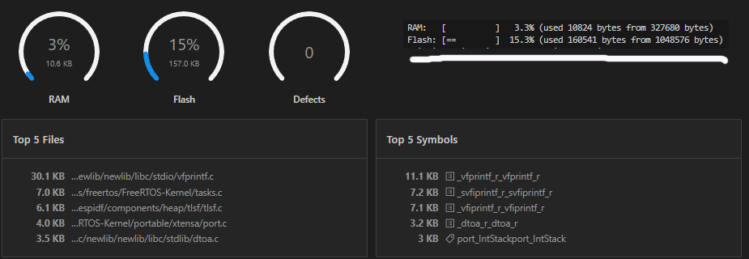
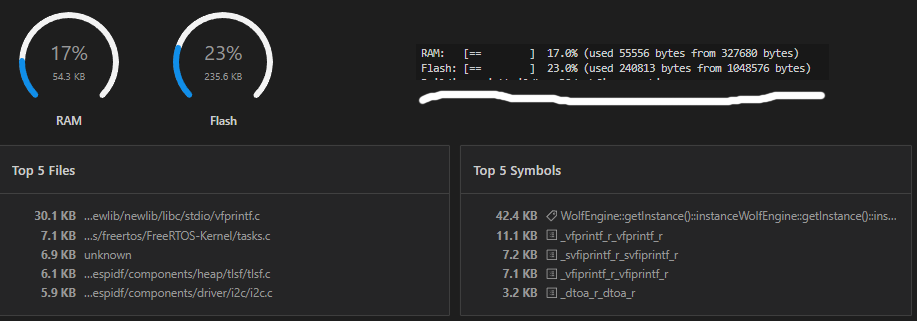

# WolfEngine ESP32 Game Engine

> A lightweight 2D game engine for ESP32 — built for tiny screens, big ideas, and people who like soldering things at 2am.

WolfEngine is a from-scratch C++ game engine targeting the ESP32 microcontroller. It ships with a built-in ST7735 TFT driver but is designed around a clean display driver interface — plug in your own driver and it works with any SPI display. It gives you a proper game loop, sprite rendering, palette-based colors, a UI system, camera, and input handling — all in a package that fits on a $5 microcontroller with 520KB of RAM.

Built with PlatformIO and ESP-IDF. No Unity. No Godot. Just you, your ESP32, and a tiny screen showing your tiny game.

---

## ✨ What It Can Do

- 🖥️ **Faster creative iteration (SDL3)** — Test and tune gameplay on desktop before deploying to hardware.
- 🎮 **Optimized for embedded systems** — Boots fast, updates smoothly, and feels responsive.
- 🎮 **GameObject + Component architecture** — Component-based objects with a clean `Start()` / `Update()` lifecycle.
- 🖼️ **Sprite rendering** — 90° rotations, layer sorting, camera-aware culling, and predictable draw order for crisp pixel visuals on small displays.
- 🎬 **Animations** — frame-by-frame animation with pause/resume, runtime frame swapping, and configurable frame timing.
- 🎨 **Palettes** — 5 customizable palettes with runtime swapping for effects like hit flash, day/night transitions, and scene mood changes.
- 🕹️ **Flexible controller inputs** — supports GPIO and I2C expanders, with joystick calibration, deadzone handling, and software debouncing.
- 👥 **Multiplayer (up to 4)** — multiple players can jump in and play together on the same setup.
- 📷 **Camera system** — smooth follow behavior, world-to-screen conversion, and visibility-aware rendering.
- 🔊 **Dual-channel audio system** — PWM-based music and SFX with looping and callback support.
- 🧠 **Flash-friendly asset model** — sprites, palettes, and settings are stored in flash to preserve RAM.
- 🖥️ **Anchored UI layout** — constructor-based UI with anchored layout and hierarchical rendering.
- 🧰 **Display-driver abstraction** — ST7735 for esp32, SDL3 for desktop and custom driver support for all your other screens.
- 🧩 **Compile-time module system** — include only the systems you need and keep the binary lean.

## 🧩 Current Modules
- 💾 **EEPROM Save/Load module** — Compile-time typed slots and integrity validation.
- 🎱 **Collision module**  — Collision detection with collider component.

---

## 📖 Documentation

Full documentation is available on the https://yagizdkurt.github.io/ESP32_WolfEngine/
---

## 📊 Memory Usage

WolfEngine is designed to be memory efficient. Below is the memory footprint on a standard ESP32 (320KB usable RAM, 1MB app partition).

### Empty Project vs With Engine

| | Empty Project | With WolfEngine | Engine Cost |
|---|---|---|---|
| RAM | 10.8 KB (3.3%) | 55.6 KB (17%) | +44.8 KB |
| Flash | 160 KB (15.3%) | 240 KB (23%) | +80 KB |

Empty build with just empty main:

Build with Wolfengine initialization:

### Where does the RAM go?

Of the 44.8KB the engine adds, **42.4KB is the framebuffer** (`128 × 160 × 2 bytes`). This is the unavoidable cost of driving a color display — every pixel on screen needs to live somewhere in RAM. The engine itself, all its systems, registries, and state combined cost only **~2.4KB**.

### Flash-Friendly by Design

Sprite pixel data, palettes, animations, and settings are all declared `constexpr` — they live in flash, not RAM. No matter how many sprites or palettes your game has, the RAM cost stays flat. Only runtime state (game objects, component data, timers) uses RAM. 

### Plenty of Headroom - From 1 MB to 16 MB of flash

With 17% RAM used and 23% flash used, there is substantial room for game content, assets, and logic. At 30fps with a full sprite system, input handling, UI, sound, and camera — WolfEngine leaves ~270KB of RAM free for your game. Also consider testing esp only has 1 MB of flash which most esp32 boards have 4 to 16, this leaves you alot of room for game assets.

---

## 🗺️ Roadmap

- [x] Multiplayer support  
  - Multiple IO expanders for multiple controllers
  - 4 controller support
  - More IO Drivers!

- [ ] More UI Elements
  - More UI elements like textbox, circle panel, scrolls.
  - Menu UI support like selectable buttons.
  - UI edge helper for better looking game/UI screen split.

- [X] Save/Load manager
  - Saving and loading support with EEPROM.

- [ ] Colliders and detection
  - Collision detection with OnCollide() checkers.
  - Collider element that stops objects from passing each other.

- [ ] Hardware settings
  - Most common ESP-32 boards have around 5kb ram and 4mb flash. Which is the "default of engine". This is why we mostly used palettes, static sprites etc. Yet some boards have larger ram and you may want to develop using dynamic variables. Thus we want to add a compiler spesified setting like RAM_LOW RAM_HIGH definition to make dynamic sprites etc possible.

- [ ] More screen drivers
  - At the moment the engine only have 1 default driver with support to user coded drivers. We want to expand the drivers. Which is easy to code but I only have one physical screen at hand so yea...

---

## 📜 License

Apache 2.0 License — free to use, modify, and ship in your own projects, personal or commercial.
Just keep the credit. A mention in your readme or about screen is enough.

---

## 🤝 Contributing

Found a bug? Have an idea? PRs and issues are welcome.
This is a hobby project so don't expect enterprise response times — but do expect genuine interest.

---

*Made with too much coffee and a love for tiny hardware. — [@yagizdkurt](https://github.com/yagizdkurt)*

